# Accomplished aplikacija

Accomplished aplikacije je habit tracker aplikacija koja korisnicima pruža mogućnosti praćenja
svojih aktivnosti razvrstanih po kategorijama. Kao osnovne karakteristike i prednosti upravo ove habit track
aplikacije izdvojili bismo upravo jednostavanost pri korištenju te lijep, moderan i oku ugodan izgled.
Sama aplikacija kreirana je u Android Studio-u korištenjem Kotlin jezika.
Prilikom izrade aplikacije primjenjivali smo različte tehnike da bismo došli do što bolje funkcionalnosti aplikacije.
U nastavku teksta će iste biti opisani, ali uporedo ćemo nastojati objasniti kako arhitekturu aplikacije tako i koncepte
rada sa Room bazom podataka i njenom primjenom kojima smo se vodili prilikom izrade ove aplikacije.

Na samom početku reći ćemo nešto više o načinu rada ove aplikacija.  
Dakle, na samom početku se izdvaja činjenica da je korisniku
omogućeno bilježenje dnevnih aktivnosti kao što su dužina sna, broj pređenih kilometara i sl pri čemu
je svaka od aktivnosti smještena u određenu kategoriu koju je sam korisnik ranije definisao.
Prije samog početka praćenja, korisniku je po default-u ponuđen određeni broj kategorija (tačnije 3 kategorije).
Svaka od tih kategorija ima svoje aktivnosti koje mogu biti različitih tipova. Kada govorimo o tipovima aktivnosti svake kategorije
izdvajaju se 3 tipa. Prvi tip su vremenske aktivnosti koje mjere vrijeme izvršavanja određene aktivnosti. Zatim je tu i inkrementalni
tip koji broji određene poraste ili smanjenja na aktivnosti kao što je smanjenje broja ispušenih cigareta i sl.
Treći tip kojeg aktivnost može biti je količinski. Pod količinskim se misli na npr uneseni broj kalorija na dnevnoj osnovi ili slično.
Dakle, korisniku se omogućava da doda novu kategoriju a samo dodavanje se sastoji od davanja imena kategorije
i kratkog opisa iste. Klikom na svaku od kategorija korisniku se prikazuje niz aktivnosti, te mu je
omogućeno dodavanje neke nove aktivnosti. Ono što je bitno istaci jeste da je kako kategorije tako i
aktivnosti moguće editovati ili brisati. Naravno korisnici prilikom same rotacije ekrana ne gube
podatke, a to indirektno implicira da je omogućen i horizontalni kao i vertikalni layout.

Nakon grubo opisanih principa rada aplikacije, u nastavku dokumentacije nastojat ćemo što bolje opisati
principe kojim smo se vodili kao i načine kreiranja ove aplikacije. Pored tekstualnog opisa,
nastojat ćemo i slikovito dočarati ono na čemu smo radili tokom izrade aplikacije.

## **GENERALNO O ARHITEKTURI ANDROID APLIKACIJE**
Dugogodišnji izbor pri izradi mobilnih aplikacija zasigurno je bila Java, ali pojavom modernih jezičkih
prednosti kao što su lambda funkcije, nullable tipova podataka i tokova podataka tzv stream-ova Kotlin je
polahko ali zasigurno počeo da preuzima ulogu vodećeg jezika za razvoj i izradu mobilnih aplikacija.
Po definiciji Kotlin je statički tipiziran programski jezik za razvoj multiplatformskih aplikacija.
Kotlin kao jezik je vrlo koncizan, interoperabilan, bezbjedan, sa odličnim razvojnim alatima i okruženjem.
Iako je Kotlin u upotrebi već neko vrijeme naručito u razvoju mobilnih aplikacija, Google i Andorid su
prvi put odlučili da podrže novi programski jezik za neki od svojih proizvoda. Upravu tu se uočava prednost
Kotlina, jer kako kažu Kotlin je taj koji razvoj Andorid aplikacija čini lakšim i interesantnijim.
Andorid platforma je pisana upotrebom Jave ali ni povezivanje sa Kotlinom nije problem s obzirom da su Java i Kotlin
u potpunosti interoperabilni. Šta to znači? Pa to znači da je omogućeno pokretanja java koda u Kotlin
datotekama i obrnuto bez dodtano trošenja memorije ili vremena. Ovim se omogućilo da aplikacije ne moraju
biti u potpunosti pisane u Kotlinu. Pored toga, kao jedna od bitnijih značajki Kotlina jeste da njegove
mogućnosti ne zavise primarno od verzije Jave koja se koristi kao niti od verzije Andorida, što je značajna
razlika u odnosu na Javu.

Pređimo sada na neke generalne osobine arhitekture aplikacija. Trenutno mjesto najzastupljenijeg arhitektonskog
obrasca u Andoridu zauzima Model-View-Presenter, MVP. Razlog za to leži u jednostavnosti, prilagodljivosti kao i brzini.
Kada se uzmu principi troslojne arhitekture i nadograde s navedenim prednsotima android
arhitekture, dobiva se osnovni način rada svake moderne arhitekture koja se koristi za razvoj
android aplikacija. Kreiranjem različitih veza između slojeva i dodavanjem dodatnih
odgovornosti, može se izgraditi konkretna arhitektura iz one osnovne.
Jedan primjer takve arhitekture je MVP koja se zasniva se na tri sloja gdje view odgovara
sloju korisničkog sučelja, presenter odgovara sloju poslovne logike, a model odgovara sloju
podataka. Ukoliko odemo korak dalje, često se koristi i četvrti sloj interactor koji je posrednik
između presenter-a i modela. U tom slučaju interactor preuzima odgovornost za poslovnu
logiku, a presenter prima gotove obrađene podatke. Svaki sloj ove arhitekture ima jasno definisane
zadatke koje treba da ispunjava.

Model sloj u arhitektonskom sloju jedne aplikacije, reprezentira sloj podataka i kao takav je zadužen
za dohvaćanje i slanje podataka iz bilo kojeg izvora. Izvor može biti web servis, interna baza podataka, lokalni JSON dokument,
bluetooth servisi i sl. Kada sloj primi podatke, oni znaju biti u različitim oblicima ili je moguće da dobivamo
suvišne podatke koji nam ne trebaju. Da bi smanjili potrošnju memorije i vrijeme obrade
podataka u sloju poslovne logike, potrebno je dobivene podatke mapirati iz modela podataka u
takozvane domenske modele koji odgovaraju domeni na koju se odnose.

Sloj presenter prima obrađene podatke članaka od interactor-a i predaje ih u sloj view
gdje će se prikazati. Budući da postoji obostrana veza između slojeva, tok podataka može ići i
u drugom smjeru, odnosno od korisnika prema obradi podataka.

View se odnosi na sam ekran, odnosno na ono što korisnik može vidjeti na ekranu. On
je odgovoran za korisnikove akcije poput pritiska na gumb, pisanja teksta i sl. Sve podatke koji
se prikazuju na ekranu dobiva od presenter-a ili od korisnika koji ih unese.

Pored MVP-a jedan od poznatijih uzoraka dizajna za arhitekturu je MVC. Najčešće se koristi kod izrade
web i desktop aplikacija, dok se za izradu android aplikacija koristi samo u nekim dijelovima
svijeta. MVC arhitektura je vrlo slična prethodno objašnjenoj MVP arhitekturi, a sadrži i dva ista
sloja, model i view dok je razlika u sloju poslovne logike controller. Osim imena, controller se
razlikuje od presenter-a po tome da se u njemu nalazi logika koja odgovara na akcije korisnika.
Dok je u MVP uzorku dizajna svaki view sloj imao svoj presenter sloj, u MVC uzorku dizajna
više view slojeva mogu dijeliti zajednički controller sloj, a on će odlučivati koji view treba
trenutno biti aktivan.U MVP arhitekturi, view i model nisu imali direktnu vezu komunikacije dok je u MVC arhitekturi stvar
drugačija. Postoji posebni model prezentacijskoj sloja. View se pretplaćuje na promjene tog
modela. Kada korisnik napravi akciju na ekranu, akcija se prosljeđuje s view-a na controller
koji zatim radi promjenu nad modelom podataka. Budući da je view pretplaćen, on će se
indirektnom vezom automatski promijeniti bez da podaci idu nazad preko controller-a. Kod model
sloja ostaje isti kao što je ranije objašnjen u MVP arhitekturi. Međutim,
njegova svrha više nije da vraća podatke u sloj poslovne logike već da ih predaje direktno na
view. Controller ima zadaću odgovoriti na akciju korisnika, po potrebi promijeniti view i
zatražiti promjenu nad model-om. Za razliku od MVP arhitekture, Controller se ne pretplaćuje
na promjene u model-u, niti ne predaje nikakve podatke nazad u view već samo manipulira
trenutnim podacima. View se pretplaćuje na podatke koje želi prikazati na ekranu. Na neku korisnikovu
akciju, poziva se controller koji je odgovoran za nju. View ne smije znati što se događa u
pozadini, već samo zna da očekuje nove podatke na koje je pretplaćen. Kada bismo krenuli u izradu android
aplikacije, morali bismo odabrati neku arhitekturu prema kojoj ćemo raditi. Prilikom odabira,
važno je znati koje su prednosti i koji su nedostaci pojedine arhitekture.

## **DETALJNO O ARHITEKTURI ACCOMPLISHED APLIKACIJE**
U nastavku teksta će biti detaljnije opisana sama arhitektura ove, Accomplished, aplikacije. Da bi se uspostavila i sama
funkcionalnost aplikacije potrebno je izmedju ostalog bilo i unutar Gradle skripte unijeti sve potrebne zavisnosti
(a iste su prikazane i na slikama).

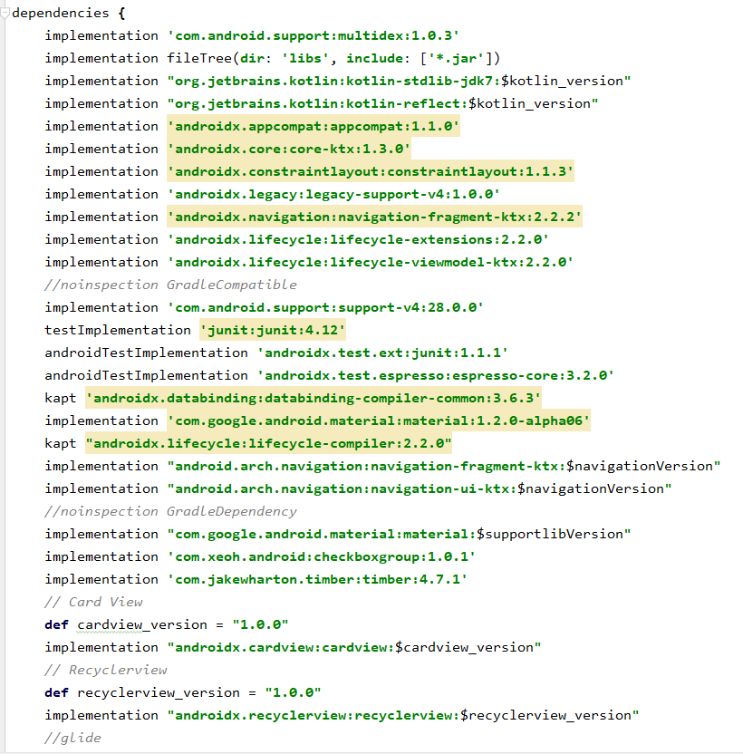

Naša aplikacije je rađena uz pomoć fragemnata, lokalne baze podataka korištenjem Room-a, kako i druih dobrih praksi za razvoj mobilnih
aplikacija. Na pitanje šta su to fragmenti u andoridu, odgovor dolazi iz samog naziva. Fragmenti su dijelovi
interfacea same aplikacije ili čak neka pozadina koja se koristi ili se može koristiti unutar aktivosti.
Interakcija sa fragmentima je ostavrena kroz FragmentManager. Fragment klasa je ta koja se koristi za
predstvaljane nekih ključnih i nitnih operacija koje se vrše nad interface-om. Kroz fragmente definišemo
njegov lifecycle koji je u zavisnoti od same aktivnosti. Ako je aktivnost uništena i svi fragmenti će biti
uništeni. U skupini fragmenata koje smo implementirali niti jednom ne bismo umanjili bitnost pa s toga
krenimo od početka.
Unutar layouta čuvamo upravo sam izgled tzv interface koji se prikazuje samom korisniku aplikacije. Tu podešavamo upravo sam
način prikazivanja i upravo je to ranije pomenuti view sloj koji arhitektosnki sloj aplikacije treba da ima. Unutar pomenutih layouta
se definiše i izgled kako za horizontalni tako i za vertkialni layout, s obzirom da je iste potrebno podesiti da prilikom rotacije
ekranu korisniku prikazuje jednak sadržaj prilagođen ekranim u vertikalnim ili horizontalnim položajima. Ono što je bitno istaći jeste
kako omogućiti navigiranje između fragmenata/aktivnosti. Ovo se postiže pomoću navigiranja engl Navigation. Dakle šta je to navigation?
Sama navigacija se odvija između odredišta naše aplikacije tj bilo gdje u našoj aplikaciji do koje korisnici mogu navigirati.
Ova odredišta su povezana putem akcija. Navigacijski graf engl navigation graph je datoteka s resursima koja sadrži sva naša odredišta i radnje.
Grafikon predstavlja sve navigacijske "staze" nvaše aplikacije. Ali postavlja se pitanje šta je to potrebno uraditi da bi se obezbjedila navigacija
među fragmentima. Prvo se kreira Resource File, pri čemu se kao Rescource Type bira navigation. Nakon ovihr adnji Android Studio kreira navigation
resource file. Nakon dodavanja navigacijskog grafa, otvaramo Navigation Editor, gdje možemo vizuelno editovati navigacijski graf gdje definišemo relacije
tj odnose među fragmentima/aktivnostima. Nakon toga isti je potrebno negdje dodati da bismo dobili ispravan prenos među fragmentima. Nakon što isti dodamo,
možemo dodatno postavljati destinacije. Prvo dodajemo fragmente a onda definišemo i odnose među njima. Ovim se omogućava konektovnje i putevi među
fragmentima/aktivnostima. Kada govorimo o konkretnom primjeru na slici ispod je prikazan odnos među našim fragmentima i destinacije među njima.

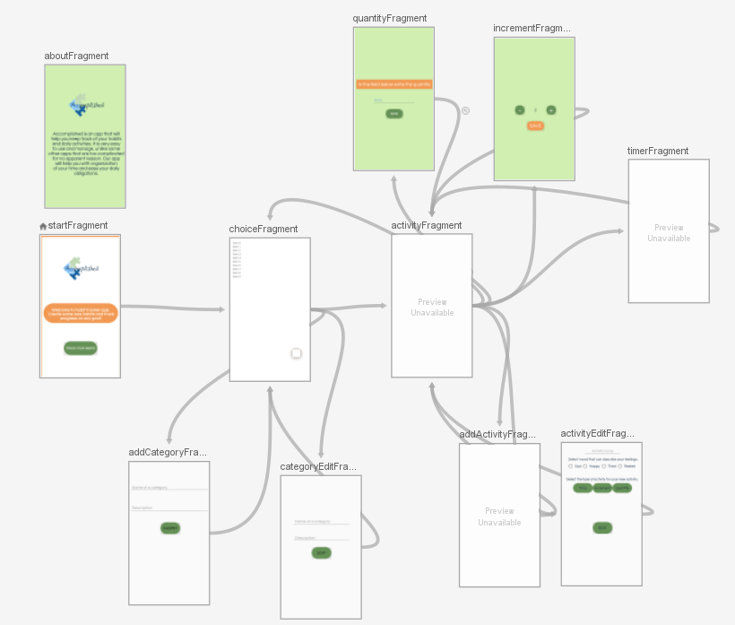

Unutar svakog fragmenta potrebno je definisati niz aktivnost za isti. Niti jedan od implementiranih fragmenata ne bismo
izdvojali kao više ili manje bitan. Za svaki od fragmenata je pored layouta za isti implementirana i logika koja se veže
za radnje koje treba da se dese ukoliko za to ima potrebe. Ono što je bitno jeste da je ova aplikacija bazirana
na Room bazi podataka pa ćemo s toga za početak objasniti kako općenito o Room-u tako i o našim primjenama na radu aplikacije.

## **ROOM BAZA PODATAKA**
Za početak se pitamo šta je to Room? Dakle **Room** je biblioteka koja pruža apstrakcijski sloj inzad SQLitea koji omogućava lakši
pristup bazi podataka dok koristi u potpunosti snagu i alate SQLitea. Postoje tri osnovne **komponente** Room-a:
1. **Entitet**: Java ili Kotlin klasa koja predstavlja tablicu unutar baze podataka. U našem slučaju je to *Kotlin* klasa.
2. **DAO**: *Dao* ili Data Access Object je sučelje koje sadrži metode kao što su getData() ili
	storeData(). Te metode se koriste za pristup bazi podataka, a to sučelje biti će
	implementirano od strane Rooma.
3. **Baza podataka**: Apstraktna klasa koju obuhvaća RoomDatabase. Ovdje se definiraju
	entiteti (tablice) i broj verzije baze podataka. Sadrži držač (engl. holder) baze podataka
	i služi kao glavna pristupna točka za spajanje.

Uočavamo pojam SQLite i samim tim se pitamo šta predstavlja SQLite. SQLite je popularan izbor kao ugrađeni softver baze podataka za
lokalno pohranjivanje klijenta u aplikativni softver poput web pretraživača. Moguće je da je to najrašireniji motor baza podataka,
jer ga danas koristi nekoliko raširenih preglednika, operativnih sistema i ugrađenih sistema (poput mobilnih telefona). Iz samog naziva
za oko zapda SQL. Kakva je veza između SQL i SQLite-a? SQL je jezik upita dok je s druge strane SQLite je ugrađeni sistem upravljanja
relacijskim bazama podataka. Dakle, nakon što smo se malo upoznali sa pojmom SQLite i razlike među SQL-a i SQLite-a nastavimo dalje sa Room-om.

Sam Room ima nekoliko ključnih aspekata koji se razlikuju od tradicionalnih ORM okvira. ORM okviri pružaju limitirani set upita,
tabele su deklarirane kao Java objekti, a odnos između tabela diktira tip upita koji se mogu obavljati. Kod Rooma su SQL inserti,
ažuriranja, brisanja i kompleksna spajanja deklarirana kao DAO. Dakle uz sam Room se veže i pojam DAO. Da bismo pristupili podacima
aplikacije koristeći Room biblioteku, potrebno je da radimo sa data access objects ili skraćeno DAO. Skup Dao objekata je nešto kao
glavna komponenta Room-a, pri čemu DAO uključuje metode koje pružaju abstraktan pristup aplikacijske baze podataka. Da bi se pristupalo
bazi podataka koristimo DAO klase umjesto direktnih upita, možemo razdvojiti različite komponente naše arhitekture baze podataka. Postoji
nekoliko korisničkih upita koji se mogu predstavljati korištenjem DAO klase.

Ono što mnogi izdvajaju kao prednost Room-a jeste:
1. Omogućava provjere za vrijeme kompiliranja
2. Dobro se poklapa sa LiveData, za nadgledanje uživo koristi LiveDATA
3. Testiranje raznih komponenti u Roomu je vrlo lako
4. Lako se koristi i implementira
5. Smanjuje količinu koda.

Bitno je naglasiti da je sam Room taj koji vodi računa o većini poslova koji se tiču postavljanja
i konfigurisanja baze podataka. Naime, većina aplikacija ima podatke koje je potrebno čuvati i nakon što
korisnik zatvrori samu apliakciju.

**ENTITET** predstavlja tabelu baze podataka. Room kreira tabelu za svaku klasu koja ima @Entity anotaciju,
a polja unutar te klase odgovaraju kolonama tabele. Same kolone tj Same propertije definišemo uz pomoć anotacije @ColumnInfo.
Dakle properti je kolona unutar tabele. Ono što je bitno naglasiti da entiteti ne sadrže nikakvu logiku i da oni predstavljaju
nešto kao male model klase. Kada govorimo o anotaciji @Entity naglašavamo da svaka model klasa sa ovom notacijom će imati mapiranu
tabelu u bazi podataka. Kao i kod svake tabele moguće je dodati primarne ključeve, foreign ključeve i itd. Sve pomenuto se takožer definira
korištenjem anotacia. Anotacija @PrimaryKey odnosi se na primarni ključ tabele. Uz autoGenerate koji ako se postavi an true, SQQLite će generirati id-eve. Kao
što smo naveli uz pomoć anotacie @ColumnInfo omogućavamo specifiranje nekih specifičnih informacija o koloni.

**DAO** je odgovoran za definiranje metoda kojima pristupamo podacima. Jednostavno definišemo naše upite engl queries korištenjem
naravno anotacije @Query unutar DAO klase.

**BAZA PODATAKA** da bi se definisala potrebno je da se definiše abstraktna klasa koja extenda RoomDatabase.
Ova klasa ima anotaciju @Database, navodeći entitete sadržane u bazi podataka kao i DAO-ove koji im pristupaju.
Klasa sa anotacijom @Database treba da ispunjava određene uslove:
1. Da bude abstraktna klasa koja nasljeduje RoomDatabase
2. Uključuje listu entitete koje baza podataka sadrži sa odgovarajućom anotacijom
3. Sadrži abstraktne metode koje imaju 0 argumenata i vraćaju klasu koje je sa anotacijom @DAO

Kada govorimo o definisanju upita i funkcija unutar DAO klasa koristimo anotacije @Insert, @Delete, @Update. S druge strane za upite koristimo
anotaciju @Query sa nizom SQLite upita kao parametrom za sve ostale upite.
Same instance baze podataka dobivamo pozivanjem Room.databaseBuilder () ili Room.inMemoryDatabaseBuilder ().

Moguće je uraditi različite vrste provjera da vidimo da li naša baza podataka kao i DAO rade onako kako se
očekuje od njih da rade. Ono što je potrebno dodati jeste odgovor na pitanje šta su to anotacije.
Anotaciju su nešto kao "omotači" za vrijednosti teksutalnih atributa ako atributi imaju karakteristike
kao napomene.

## **IMPLEMENTACIJA ROOM-a NA ACCOMPLISHED APLIKACIJU**
Nakon što se upoznali sa Room-om sa teoretskog aspekta, preći ćemo na detaljniji opis naše implementacije.
Potrebno je dodati i određene Gradle dependencies.
Nakon toga kreiramo i model klase. Kao što smo već napomenuli Room kreira tabele uz pomoć anotacije. Klase Category, Activity i Type predstavljaju
model klase podataka u bazi podataka. Klasa je anotirana sa @Entity i tableName properti koji predstavlja ime tabele. Primarni ključ smo postavili
korištenjem anotacije @PrimaryKey na ispravna polja, konkretno na polje namjenjeno za id kako aktivnosti, tako i kateorije i tipa. Također smo postavili
ime kolona za polja tabela korištenjem @ColumnInfo(name = “ime_kolone”) anotacijom. Klasa Category nam služi definisanje kategorija unutar same aplikacije.
Ono što nam je bitno jeste ime i opis same klase. ID broj je ono što je primarni ključ ove tabele i koristimo atribut autoGenerate = true. Tabelu Activity
korstimo za čuvanje podataka o samoj aktivnosti. Ono što je bitno za aktivnost jeste da pored ID te imena i opisa, čuvamo podatke o kateoriji kojoj akivnost
pripada, te tip aktivnsoti koji može biti inkrementalni, vremenski i količinski. Također, čuvamo i atribute value i feeling. value nam je potreban da bismo čuvali
vijednosti unutar same baze podataka dok feeling koristimo za čuvanje osjećaja prema aktivnosti koje korisnik može unijeti. Na kraju, tabela Type nam je potrebna za
čuvanje tipa.

 
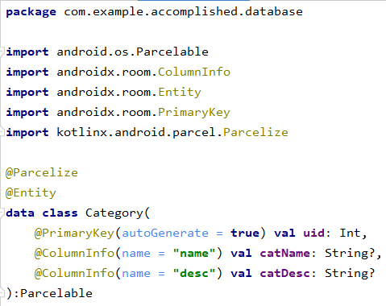
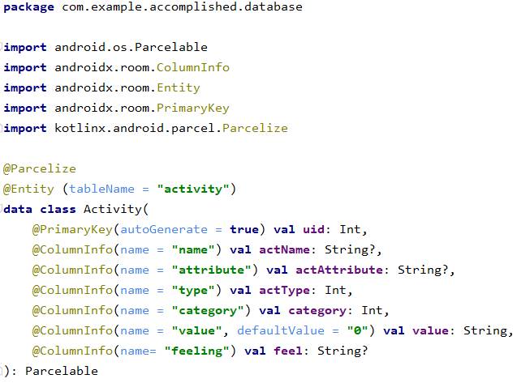
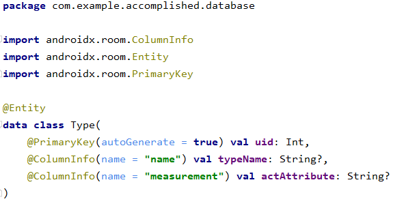
 

Nakon što smo kreirali model klase kreiramo i Data Access Objects (DAOs). Dakle uz pomoć DAO-ova smo definirali metode za pristup bazi podataka. Da bismo
kreirali DAO potrebno je da kreiramo interface i koristimo anotaciju @Dao. Unutar DAO klasa smo implementirali sve potrebne metode koje su prikazane na slikama ispod.
Neke od njih su insert podataka, update istih, brisanje kao i brojne druge. Na slici imamo primjer ActivityDao.

 
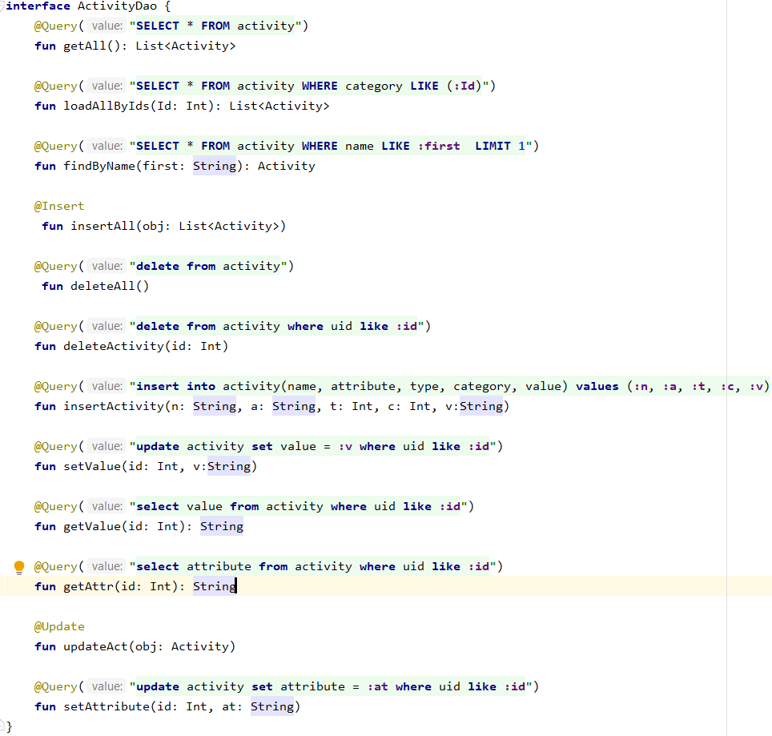
 

Na kraju nam preostaje da kreiramo i samu bazu podataka. Da bismo kreirali bazu podataka definišemo abstraktnu klasu koja nasljeđuje
RoomDatabase. Ova klasa koristi anotaciju @Database, listu entiteta sadržanih u bazi podataka, i DAO kojim pristupamo podacima.

 
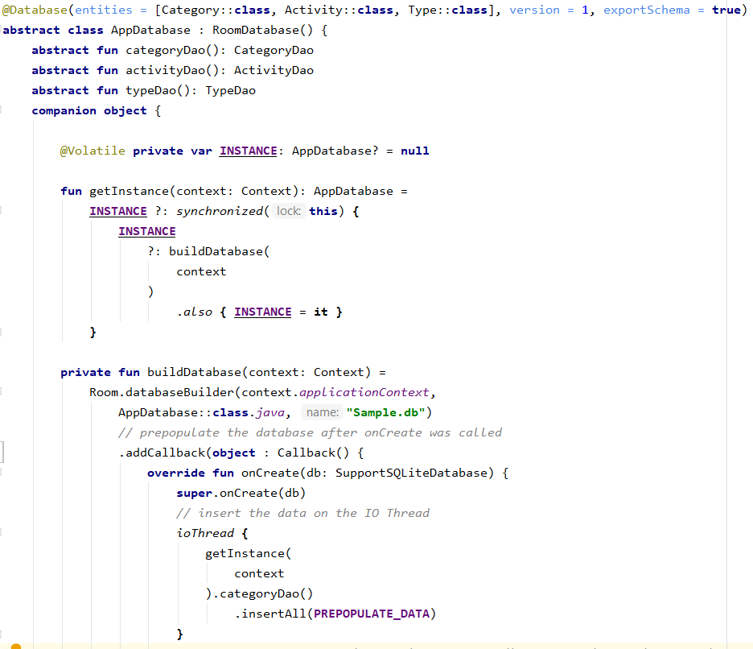
 
Nakon što smo detaljno opisali rad sa bazama podataka preći ćemo na dio koji govori o upravljanju sa podacima i njihovom implemntacijom na sam projekat.

## **FUNKCIONALNOSTI KLASA**
Dakle naša aplikacija se sastoji od ukupno 14 klasa. Svaku od tih klasa ćemo pokušati detaljno pojasnit i obrazložiti razlog upotrebe iste.
Da bismo izbjegli nejasnoće tokom nastavka teksta upoznat ćemo se sa nekoliko bitnih pojmova.
Fragmenti su uvedeni primarno da bi podržali dinamičniji i fleksibilniji UI dizajn. Svaki fragment ima svoj layout i svoje sopstvene lifecycle callback-e i
jedan fragment može se uključiti u više aktivnosti pa bi se zato trebali dizajnirati za ponovnu upotrebu. Kod Fragment klase je sličan onom kodu iz Activity klase. U Fragmentima
trebale bi se implementirati sljedeće lifecycle metode:
1. onCreate(),
2. oCreateView() i
3. onPause().
RecylerView je widget predstavljen sa Andorid Lollipop verzijom. Predstavlja fleksibilnu i efikasnu verziju ListView-a. Predstavlja nešto kao kontejner za rendanje većih
skupova podataka. Dakle on je nešto kao tradicionalni ListView widget, ali sa dosta više fleksibilnosti za prilagođavanje i optimizaciju rada sa većim datasetovima. Nameće se pitanje
kada koristiti RecylerView. Onda kada imamo neku veću listu sa prilaodovima UI komponentama onda je pogodno koristiti RecylerView.
Da bismo prikazali podatke potrebno je da koristimo RecylerView.Adapter i RecylerView.ViewHolder. RecylerView.ViewHolder predstavlja view-ove naše RecylerView-a. Ali šta je adapter?
RecylerView.Adapter predstavlja podatke koji treba da se prikazuju  sa ViewHolder-om. Unutar samog adaptera mi imamo 3 metode i oni moraju biti override-ane.
1. RecyclerView.ViewHolder onCreateViewHolder(ViewGroup parent, int viewType) -> Ova metoda vraća nove instance naše ViewHolder-a.
2. void onBindViewHolder(ProductViewHolder holder, int position) -> Ovom metodom vežemo podatke sa view holder-om.
3.  int getItemCount() -> Ova metoda vraća veličinu liste.
Dakle, objekat Adapter predstavlja nešto kao most između AdapterView-a i osnovnih podataka za taj prikaz.

## MainActivity
Ono što predstavlja main activity klasa jeste ključ android aplikacije i način na koji su aktivnosti pokrenute i sastavljene. Dakle ona je nešto kao fundamentalni dio aplikacije,
žila kucavica. Sama aktivnost nam obezbjeđuje prozor unutar kojeg se aplikacija prikazuje. Tačnije prozor unutar koga aplikacija prikazuje svoj UI. Kada govorimo o layout-u unutar
layouta ove klase se nalazi layout StartFragmenta. O StartFragmentu ćemo u nastavku.

## ActivityAdapter
Unutar ove klase smo implementirali adapter koji smo koristili za RecylerView kojim prikazujemo aktivnosti. Dakle pored override-anih metoda, implementirali smo interface metoda koje
smo koristili sa klikanje na pojedinačne item-e RecylerView-a. Pored toga za potrebe RecylerView-a smo kreirali i ActivityViewHolder klasu. Unutar iste smo postavili ono što želimo
da se prikazje unutar RecylerView-a te funkcije iz interface-a koji su nam potrebne za funkcionalnosti nad itemom.

## CategoryAdapter
Kao što smo implementirali adapter za Activity analogno smo implementirali i za adapter RecylerView korišten za prikaz kategorija.

## StartFragment
Ovaj fragment predstavlja startni fragment. Vraća layout koji će se prvi prikazivati nako pokretanja aplikacije. Postavljen je listener na dugme TRACK YOUR HABITS. Klikom
na njega korištenjem navigacije prelazimo na ChoiceFragment.

## ChoiceFragment
Unutar ovog fragmenta je nekoliko varijabli koji su nam poslužile za ispravnu logiku. Sa varijablom db definišemo samu bazu podataka. Varijabla je tipa AppDatabase. Tu je i
varijabla koja nam je poslužila za definisanje *RecylerView*-a, kao i floating action dugmeta koji smo koristili za dodavanje nove kategorije.
Sama lista kategorija nam je potrebna za RecylerView i predstavljanje istih. Da bismo dobili kategorije, iste preuzimamo iz same baze podtaka korištenjem metode getAll() koja
nam vraća sve katerorije. Metodu smo ranije implementirali unutar *CategoryDao* klase. Na floating action dugme je postavljen clickListener. Klikom na njega pomoću navigacije
prelazimo na novi fragment koji nam služi za dodavanje nove kategorije. O ovome fragment će biti govora nešto kasnije. Nakon toga smo postavili sve što je potrebno bilo za RecylerView.
Pored toga implementirane su i neke override-ane metode. Unutar adaptera potrebnog za postavljanje Adaptera kategorije smo definisali interface sa nekoliko metoda, i o tome će
riječi biti nešto kasnije, koje smo kasnije i implementirali unutar ChoiceFragmenta. Jedna od tih metda je i onItemClick(item: Category, position: Int). Ovo metodom smo omogućili
da otvorimo skup aktivnosti ove kategorije. Također su tu metode removeItem(item: Category, position: Int) i editItem(item: Category, position; Int). Metodom removeitem smo omogućili
CRUD metodu za birsanje kateorije. Dakle ovom metodom se omogućilo brisanje striktno samo jedne kategorije. Na kraju metodom editItem smo omogućili editovanje kategorije. Ukratko ovim metodama
smo omogućili da klikom na samu kategoriju omogućava se prikaz liste aktivnosti. Također su omoogućene CRUD operacije nad katergoijama metodama removeItem i editItem.

## AddCategoryFragment
Ovakav jedan fragment nam je bio potreban iz razloga implementacije i omogućavanju korisniku dodavanje nove kategorije. Nad dugmetom sa id-om submitButton je pozvan clickListener
kojim se omogućava unos nove kategorije u samu bazu podatak. Metodom insertCat smo omogućili unos nove kategorije. Sama metoda je zahtjevala dva parametra od čega je jedan bio naziv
kategorije a drugi je parametar za opis kategorije. Nakon što se klikne na dugme, podaci se spašavaju u bazu podataka te se vraćamo na ChoiceFragment.

## CategoryEditFragment
Razlog implementacije ovog fragmenta jeste da se omogući editovanje tj uređenje svake kategorije zasebno. Prilikom editovanja kategorije korisnik može da izmjeni ime kategorije ili opis
iste. Na samom početku korisniku se prikazuje ranije unešeni tekst. Taj tekst smo naravno preuzeli iz baze podataka uz ViewModel. Ukoliko korisnik želi da promejni naziv ili opis kategorije
ili pak oboje, nakon unošenja željenih naziva klikom na edit dugmo podaci se spašavaju u bazi podataka te se vraćamo na ChoiceFragment. Izmjene u bazi podataka smo izvršili primjenom metode
updateCat kojoj smo kao parametar proslijeđene varijable cName i cDesc unutar kojih smo sačuvali izmjene.

## ActivityFragment
Nakon što smo implementirali funkcionalnosti nad kategorijama ostaje nam da isto uradimo i sa aktivnostima. Unutar ActivityFragmenta ideja je bila da se implementira RecylerView koji nam je potreban
za prikaz svih aktivnosti određene klase. Za svaku aktivnost se korisniku omogućava da unese novu aktivnost o čijoj će logičkoj implementaciji kasnije biti riječi. Zatim, klikom na svaku od aktivnosti
korisniku se u zavisnoti od tipa iste prikazuje interface namjenjen za tu aktivnost. Ukoliko je aktivnost tipa timer tu nam se prikazuje timer sa dugmetom start i stop ali o njegovoj implementaciji
će biti govora u nastavku teksta. Ako je aktivnost tipa increment ili quantity prikazuje se potrebni unaprijed definisani interface. Također korisniku je omogućeno da svaku od aktivnosti editujemo.
Kada govorimo o logičkoj implementaciji spomenut ćemo nekoliko detalja koje smatramo bitnim. Za potrebe implementacije RecylerView-a potrebna nam je lista unutar koje ćemo čuvati item za ispis na RecylerView-u.
Sve ove iteme čuvamo unutar activitiesList koja je tipa Activity, dakle naše ranije definasne model klase. Kasnije za implementaciju RecylerView-a koristimo i adapter namjenjen za aktivnosti.
Pored toga klikom na floating action dugme korisniku se omogućava i pruža mu se novi interface za dodavanje nove aktivnosti. Uz pomoć navigacije prelazimo sa ActivityFragmenta na AddActivityFragment koji ćemo kasnije
detaljnije opisati. Također kao što smo rekli potrebno je bilo omogućiti da klikom na aktivnost u zavisnosti od tipa aktivnosti potreban interface. Način na koji smo to omogućili jeste ponovo korištenjem
podataka iz baze podataka. Da bismo dobili ispravne podtke o aktivnosti koristimo id. Unaprijed smo definisale tip aktivnosti. Za aktivnost smo iz baze pokupili njen tip. If uslovima smo u zavisnoti od tipa
prikazivali potrebne interface. Unutar navigacije smo definisali argumente kojima se osigurvamo da se za ispravnu aktivnost ispravne kategorije prikažemo ono što nam je potrebno. Ove ID čuvamo u varijablama actId i catId.
Također smo i implementirali metodu removeItem kojim smo omogućili da aktivnost možemo izbrisati. Isto smo uradili pomoću metoda iz DAO koja se zove deleteActivity gdje nam je za ispravno brisanje bio potreban id aktivnosti.
Da bismo omogućili editovanje aktivnosti. Sama funkcionalnost editovanja kategorije ćemo u nastavku detaljnije opisati. Unutar ove metode smo navigacijom koristeći id aktivnosti ako argument prešli za jednog na drui interface.

## AddActivityFragment
Ovim fragmentom smo korisniku pružili da može unijeti novu aktivnost koja će biti spremljena u samu bazu podataka. Unutar ove klase smo na početku implementirali korisnički interface koji nam je bio potreban za adekvatan prikaza
onoa što želimo korisniku prikazati. Nakon što korisnik unese sve što je potrebno tj što se od njega traži klikom na dugme SUBMIT se aktivnost adekvatno spašava u bazu podataka. Da bismo obezbjedili adekvatan unos na dugme smo
postavili click listener. Za potrebe spašavanja aktivnosti bilo nam je potrebno nekoliko stvari. Jedna od njih je i bilo spašavanje atributa aktivnosti tj ukoliko je aktivost tipa increment potrebno je bilo spasiti inkrementalne
vrijednosti koje je korisnik ranije unio. Sa druge strne ako je aktivnost tipa quantity potrebno je bilo spasiti mjerne jedinice za koje se korisnik ranije odlučio. Isto tako porebno je bilo spasiti i ime aktivnosti. To ime
smo pokupili iz samog korisničkog unosa. Na osnovu dobivenih podataka iste je potrebno spasiti u bazi podataka. Unos podataka u bazu podataka smo omogućili metodom insertActivity gdje smo proslijedili ime aktivnosti preuzeno od
korisnikovog unosa, atribut aktivnosti u zavisnosti od tipa iste, tip aktivnosti koji smo spoznali korisnikovim izborom tipa, te na kraju spašavamo i id kategorije kojoj je pripadala aktivnost te value koja je prazan string a koji
nam je potreban za kasnije radnje. Naravno pomoću navigacije smo prelazili sa jednog interfacea na drugi.
Podatak o tip aktivnosti smo dobili na način da smo prateći korisnikov klik isti spašavali u varijablu bt te tako kasnije i prikazivali ono što je korisniku potrebno a kasnije i spašavali unutar sam
baze podataka.

## ActivityEditFragment
Implementacijom ovog fragmenta smo korisniku omogućili editovanje same aktivnosti. Dakle klikom na dugme za editovanje aktivnosti smo unutar ActivityFramenta definisali navigacijski prelazak sa jednog na drugi prikaz.Sada je potrebno pojasniti logičku implementaciju editovanja aktivnosti. Nakon definisanja bidinga i varijable baze podataka potrebno ostalo je da podatke adekvatno spašavamo u bazu podataka. Na samom početku smo
također implementirali neke funkcionalnosti namjenjene za adekvatan korisnički prikaz. Kao i za unos aktivnosti tako i za edit iste potrebno je da znamo informacije koje se edituju da bismo omogučili adekvatan update podataka
u bazi podataka. Pored opisanog načina za čuvanja atributa aktivnosti u dijelu gdje smo objanili AddActivityFragment fragmenta, ovdje smo na isti način omogućili da čuvamo informacija o korisnikovim osjećajima prema samoj aktivnosti.
Definisali smo varijablu updated unutar koje smo spremili podatke za aktivnost dobivene na osnovu unešenih podataka. Podatke editujemo u bazu podataka pomoču updateAct koju smo ranije definisali unutar DAO klase za aktivnost.
Klikom na dugme edit smo promjene spasili u bazu podataka te navigacijom omogućili povratak na korsnički interface namjenjen za prikaz niza aktivnosti unutar RecylerView-a.

## IncrementFragment
Na osnovu tipa aktivnosti koji korisnik unosom nove aktivosti korisniku se klikom na samu aktivnost prikazuje se adekvatan prikaz. Kada govorimo o layoutu korisniku je omogućeno pritiskom na dugme povećanje ili smanjenje nečega
što želimo mjeriti. Promjene spašavamo na dugme SAVE. Kad govorimo o logičkoj implementaciji potrebno je prikazivati podatke i čuvati podatke o ID-u aktivnosti i kateorije. Metodom getAttr implementirane unutar DAO klase ukoliko je
postavljamo vrijednosti. Ovim postavljali tzv increment. Sve korištene metode smo ranije definisali unutar DAO klasa.

## TimeFragment
Ovaj timer nam je potreban za vremenski tip aktivnoti. Princip kojim funkcionisu aktivnosti vremenskog tipa tako što korisnik klikom na dugme start timer počinje da odbrojava dok na dugme stop timer prestaje sa odbrojavanjem.
Layout je implementiran korištenjem chronometera i dugmetom koji nam služe pa pokretanje i stopiranje timera. Potrebno je prikazati vrijednost timera i zato smo koristili medote definisane unutar DAO klase za aktivnosti.

## QuantityFragment
Razlog iz kojeg smo kreirali ovaj frament leži u činjenici da imamo tri tipa aktivnosti i za svaki od tipova nam je bio potreban fragment pa tako i za quantity tip. Sam layout je kreiran da se korisniku omogućava da unese koločinu
onoga što treba da mjerimo. Logički je fragment implementiran na način da se metodom implemntiranom setValue u DAO klasi unešena vrijednost unosi u bazu podataka i tako radimo update baze podataka.
Navigacijom se vraćamo na layout unutar kojeg se prikazuju aktivnosti kategorije.

## **UI-KORISNIČKI INTERFACE**
Sam prikaz korisničko interface-a je prikazan na slikama ispod.
Početni prikaz aplikacije. Imamo i NavDrawer koji daje link za detaljnije informacije o aplikaciji.

 

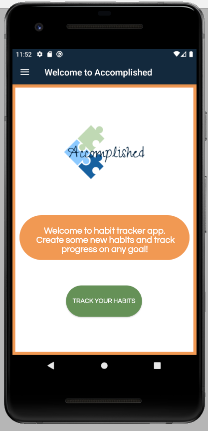 .
 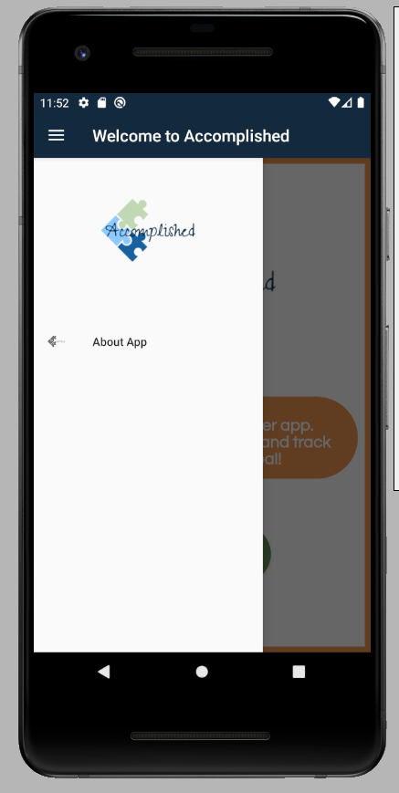 .
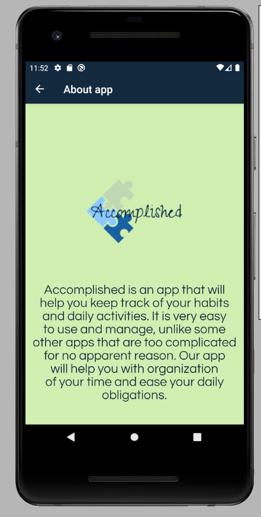

 

Klikom na dugmić Track your habits otvaraju se kategorije.
Da bi dodali kategoriju, dovoljno je pritisnuti Plus na dnu ekrana. Za editovanje kategorije koristimo dugmić Olovka, a za brisanje Kantu.

 

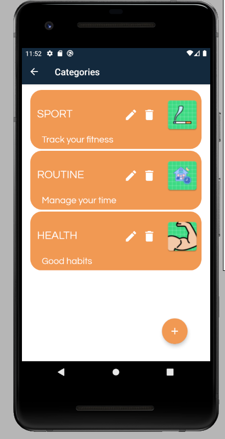 .
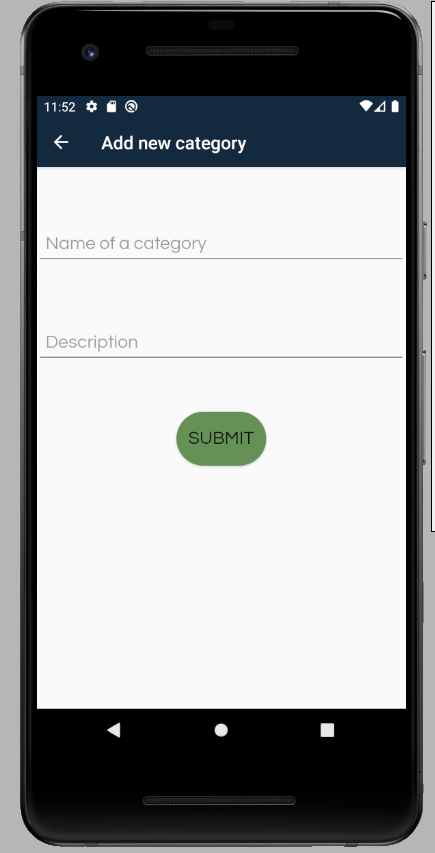 .
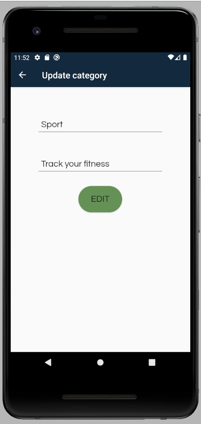

 

Klikom na neku od kategorija prikažu se aktivnosti definisane u njoj.
Klikom na Plus dodaje se nova aktivnost, na Olovku vodi na do edit-a, dok klikom na Kantu briše se aktivnost.

 

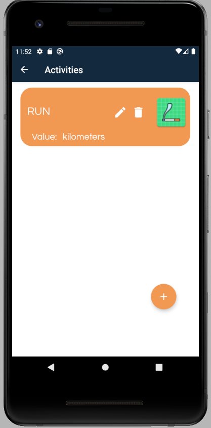 .
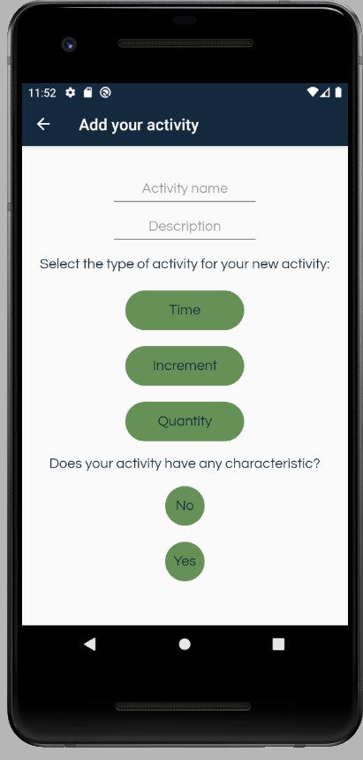 .
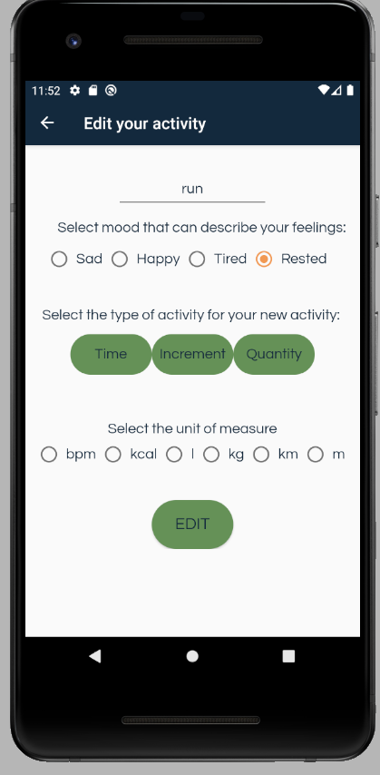

 

Prilikom editovanja ili dodavanja imamo da biramo neke od ponuđenih karakteristika.

 

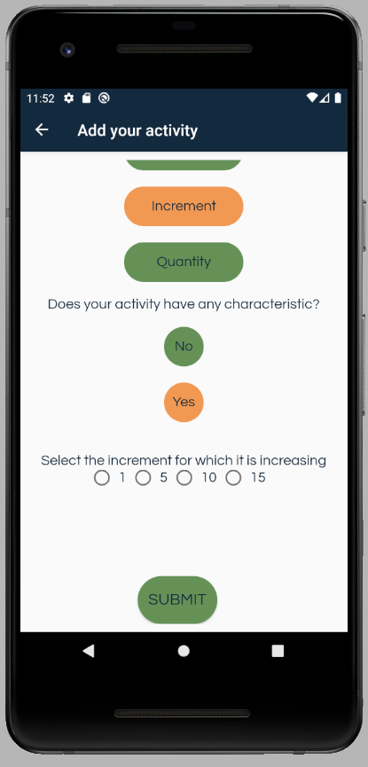 .
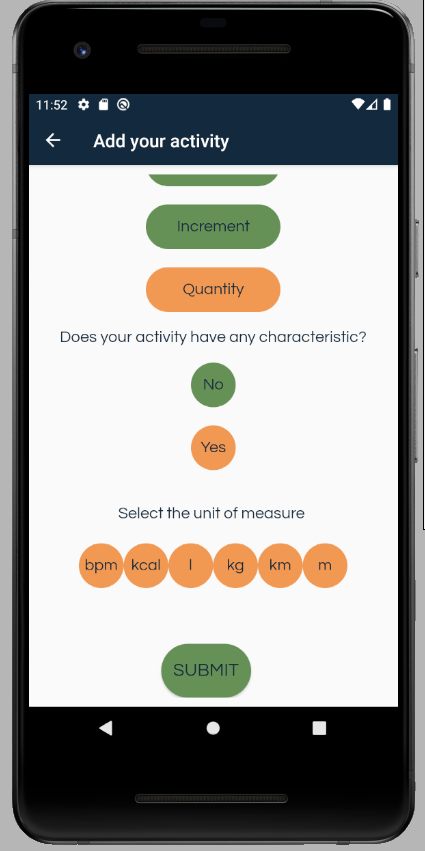

 
U zavisnosti od vrste aktivnosti, tj. da li je ona inkrementalna, kolicinska ili vremenska prikazuje se sljedeće:

 

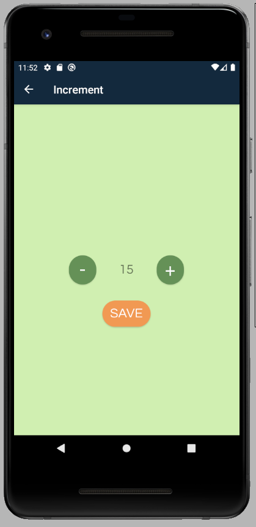 .
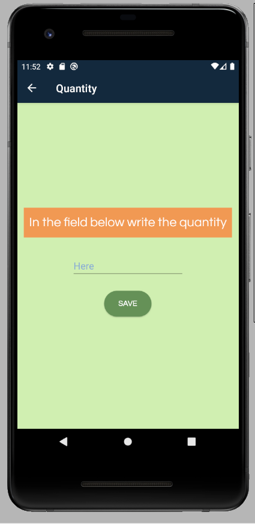 .
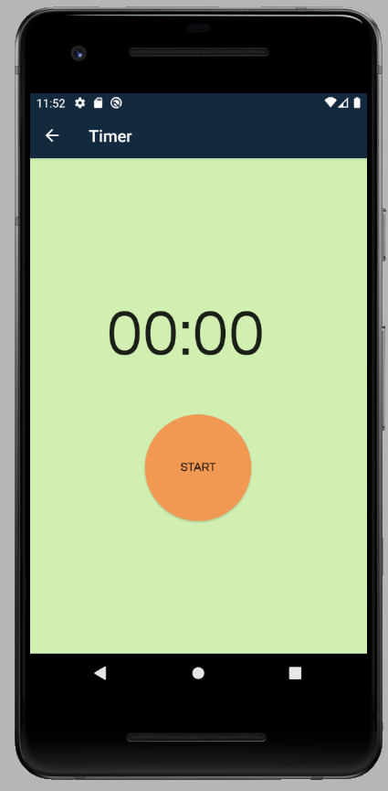

 

Svaki izbor korisnika direktno se sprema u bazu i vraća ga na listu kategorija ili aktivnosti.

